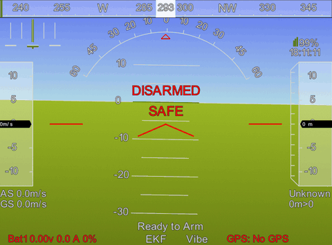

# IMU MAVLink Project

Проект призначений для зчитування даних з одного або кількох датчиків MPU6050 через I2C, обробки їх у програмі на C++, а також передачі орієнтації та стану датчиків через MAVLink UDP.

## Що реалізовано

- Підтримка кількох IMU (до 4 пристроїв)
- Ініціалізація та перевірка працездатності MPU6050
- Зчитування акселерометра та гіроскопа
- Об’єднання даних з кількох датчиків
- Розрахунок кута нахилу (roll, pitch, yaw)
- Передача даних через MAVLink до зовнішньої системи
- Відстеження стану датчиків та повторне підключення при втраті зв’язку



## Архітектура

- `src/main.cpp` — точка входу, налаштування конфігурації та запуск
- `src/imu/mpu6050_driver.cpp` — драйвер MPU6050
- `src/imu/imu_manager.cpp` — керування датчиками та повторними запуском
- `src/imu/sensor_fusion.cpp` — сенсорний ф’южн для оцінки орієнтації
- `src/mavlink/mavlink_communication.cpp` — формування MAVLink-повідомлень
- `src/mavlink/mavlink_transport_udp.cpp` — UDP-transport для MAVLink


## Збірка

```bash
cd /home/pi/Study/cpp/project
cmake -S . -B build
cmake --build build
```

## Запуск

```bash
./build/imu_cli --mavlink-host 127.0.0.1 --mavlink-port 14550
```

Можна також вказати конкретні пристрої та адреси IMU:

```bash
./build/imu_cli \
  --dev0 /dev/i2c-1 --addr0 0x68 \
  --dev1 /dev/i2c-3 --addr1 0x68
```

## Приклад виводу

```text
[INFO] IMUs configured: 2
[INFO] IMU 0: /dev/i2c-1 @ 0x68
[INFO] IMU 1: /dev/i2c-3 @ 0x68
[INFO] MAVLink destination: 127.0.0.1:14550
[INFO] IMU 1 online
[INFO] IMU 0 online
```

## Призначення

Проект може використовуватися як основа для систем стабілізації, навігації або керування вбудованими пристроями, де необхідні дані про орієнтацію у просторі та відправка їх у MAVLink-мережу.
